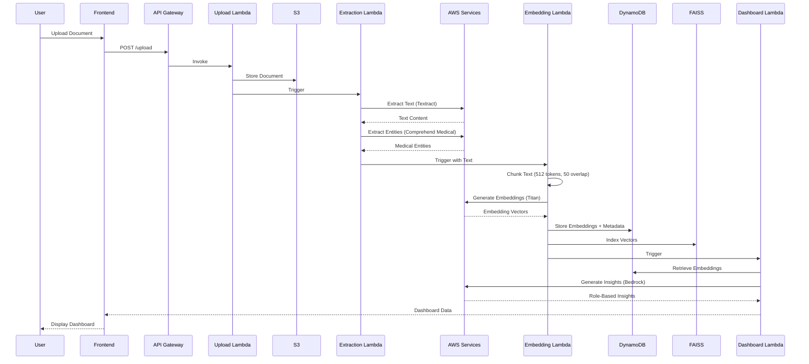
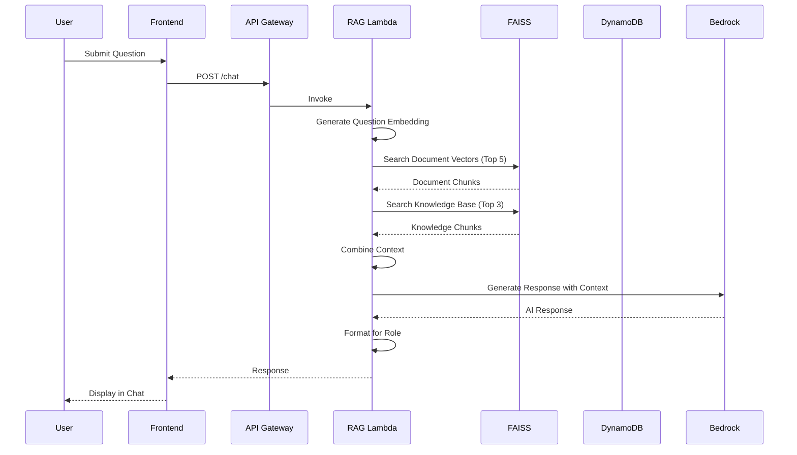
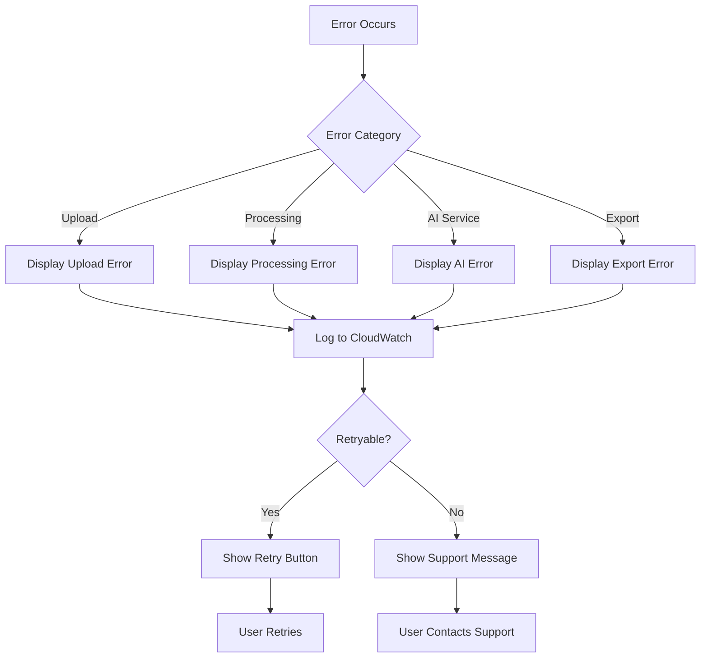

# Design Document

## Overview

The MedAssist AI System is a serverless, single-page React web application that leverages AWS Generative AI services and Retrieval-Augmented Generation (RAG) to analyze medical documents and provide role-based health insights. The system processes medical documents (PDFs, lab reports, prescriptions) through a multi-stage AWS pipeline and generates contextual responses using Amazon Bedrock Nova 2 Lite model.

### Key Design Goals

1. **Role-Based Personalization**: Tailor language complexity and content focus based on user role (Doctor, Patient, ASHA Worker)
2. **Hybrid RAG Architecture**: Combine user-uploaded documents with a pre-embedded medical knowledge base for comprehensive responses
3. **Serverless Scalability**: Leverage AWS Lambda and managed services to scale automatically without infrastructure management
4. **Real-Time Processing**: Provide dashboard insights and chat responses within seconds of document upload
5. **Security and Privacy**: Encrypt data at rest and in transit, implement session-based data lifecycle management

### Technology Stack

- **Frontend**: React (single-page application), dark theme with liquid glass styling
- **Backend**: AWS Lambda (Python), API Gateway (REST)
- **AI/ML**: Amazon Bedrock Nova 2 Lite, Amazon Titan Embeddings, AWS Comprehend Medical
- **Document Processing**: AWS Textract, AWS Rekognition
- **Storage**: AWS S3 (documents), DynamoDB (embeddings, metadata)
- **Vector Search**: FAISS (Facebook AI Similarity Search)
- **Monitoring**: AWS CloudWatch

## Architecture

### System Architecture Diagram

```mermaid
graph TB
    subgraph "Frontend Layer"
        UI[React SPA]
        RoleSelector[Role Selector]
        Upload[Upload Component]
        Dashboard[Dashboard with Stat Cards]
        Chat[Chat Interface]
    end
    
    subgraph "API Layer"
        APIGW[API Gateway]
        UploadAPI[/upload]
        ChatAPI[/chat]
        DashboardAPI[/dashboard]
        ExportAPI[/export]
    end
    
    subgraph "Processing Layer"
        UploadLambda[Upload Lambda]
        ExtractionLambda[Extraction Lambda]
        EmbeddingLambda[Embedding Lambda]
        RAGLambda[RAG Lambda]
        DashboardLambda[Dashboard Lambda]
        ExportLambda[Export Lambda]
    end
    
    subgraph "AI Services"
        Textract[AWS Textract]
        Rekognition[AWS Rekognition]
        Comprehend[Comprehend Medical]
        Bedrock[Bedrock Nova 2 Lite]
        Titan[Titan Embeddings]
    end
    
    subgraph "Storage Layer"
        S3[S3 Bucket]
        DynamoDB[(DynamoDB)]
        FAISS[FAISS Index]
    end
    
    UI --> APIGW
    APIGW --> UploadAPI --> UploadLambda
    APIGW --> ChatAPI --> RAGLambda
    APIGW --> DashboardAPI --> DashboardLambda
    APIGW --> ExportAPI --> ExportLambda
    
    UploadLambda --> S3
    UploadLambda --> ExtractionLambda
    ExtractionLambda --> Textract
    ExtractionLambda --> Rekognition
    ExtractionLambda --> Comprehend
    ExtractionLambda --> EmbeddingLambda
    
    EmbeddingLambda --> Titan
    EmbeddingLambda --> DynamoDB
    EmbeddingLambda --> FAISS
    EmbeddingLambda --> DashboardLambda
    
    RAGLambda --> FAISS
    RAGLambda --> DynamoDB
    RAGLambda --> Bedrock
    
    DashboardLambda --> Bedrock
    DashboardLambda --> DynamoDB
```

### Processing Pipeline Flow



### Chat Query Flow



## Components and Interfaces

### Frontend Components

#### 1. RoleSelector Component
```typescript
interface RoleSelectorProps {
  selectedRole: 'doctor' | 'patient' | 'asha';
  onRoleChange: (role: string) => void;
}

// Renders three role options in sidebar
// Triggers dashboard regeneration on role change
```

#### 2. DocumentUpload Component
```typescript
interface DocumentUploadProps {
  sessionId: string;
  onUploadComplete: (documentId: string) => void;
  onUploadError: (error: string) => void;
}

// Accepts PDF, JPEG, PNG files
// Shows upload progress
// Calls /upload API endpoint
```

#### 3. Dashboard Component
```typescript
interface DashboardProps {
  sessionId: string;
  role: string;
  statCards: StatCard[];
}

interface StatCard {
  title: string;
  value: string;
  unit: string;
  insight: string;
  severity: 'normal' | 'warning' | 'critical';
}

// Displays stat cards in grid layout
// Updates when new documents are processed
// Supports Hindi translation for Patient/ASHA roles
```

#### 4. ChatInterface Component
```typescript
interface ChatInterfaceProps {
  sessionId: string;
  role: string;
  onSendMessage: (message: string) => void;
}

interface ChatMessage {
  id: string;
  sender: 'user' | 'ai';
  content: string;
  timestamp: Date;
}

// ChatGPT-style conversational layout
// Maintains chat history
// Max 1000 characters per message
// Shows typing indicator during AI response
```

#### 5. ExportButton Component
```typescript
interface ExportButtonProps {
  sessionId: string;
  role: string;
  statCards: StatCard[];
}

// Calls /export API endpoint
// Downloads PDF to user device
```

### Backend API Endpoints

#### POST /upload
```json
Request:
{
  "sessionId": "string",
  "role": "doctor|patient|asha",
  "file": "base64-encoded-file",
  "filename": "string",
  "contentType": "string"
}

Response:
{
  "documentId": "string",
  "status": "processing",
  "message": "Document uploaded successfully"
}
```

#### POST /chat
```json
Request:
{
  "sessionId": "string",
  "role": "doctor|patient|asha",
  "message": "string",
  "language": "en|hi"
}

Response:
{
  "response": "string",
  "sources": ["string"],
  "timestamp": "ISO-8601"
}
```

#### GET /dashboard
```json
Request Query Parameters:
{
  "sessionId": "string",
  "role": "doctor|patient|asha",
  "language": "en|hi"
}

Response:
{
  "statCards": [
    {
      "title": "string",
      "value": "string",
      "unit": "string",
      "insight": "string",
      "severity": "normal|warning|critical"
    }
  ],
  "lastUpdated": "ISO-8601"
}
```

#### POST /export
```json
Request:
{
  "sessionId": "string",
  "role": "doctor|patient|asha",
  "language": "en|hi"
}

Response:
{
  "pdfUrl": "string",
  "expiresAt": "ISO-8601"
}
```

### Lambda Functions

#### 1. UploadLambda
**Purpose**: Handle document upload and initiate processing pipeline

**Input**: API Gateway event with file data
**Output**: Document ID and processing status

**Operations**:
- Validate file type (PDF, JPEG, PNG)
- Generate unique document ID
- Store file in S3 with session-based path
- Invoke ExtractionLambda asynchronously
- Return success response

#### 2. ExtractionLambda
**Purpose**: Extract text and medical entities from documents

**Input**: S3 event with document location
**Output**: Extracted text and entities

**Operations**:
- Retrieve document from S3
- Call AWS Textract for text extraction
- Call AWS Rekognition for image analysis (if image)
- Call AWS Comprehend Medical for entity extraction
- Pass extracted data to EmbeddingLambda
- Log extraction metrics to CloudWatch

#### 3. EmbeddingLambda
**Purpose**: Generate and store embeddings for document chunks

**Input**: Extracted text and entities
**Output**: Stored embeddings in DynamoDB and FAISS

**Operations**:
- Split text into 512-token chunks with 50-token overlap
- Generate embeddings using Amazon Titan Embeddings
- Store embeddings in DynamoDB with metadata
- Index embeddings in FAISS
- Trigger DashboardLambda
- Log embedding metrics to CloudWatch

#### 4. RAGLambda
**Purpose**: Handle chat queries using hybrid RAG retrieval

**Input**: User question, session ID, role
**Output**: AI-generated response

**Operations**:
- Generate embedding for user question
- Search FAISS for top 5 document chunks
- Search FAISS for top 3 knowledge base chunks
- Combine retrieved context
- Construct role-specific prompt
- Call Bedrock Nova 2 Lite for response generation
- Format response based on role
- Return response within 5 seconds
- Log query metrics to CloudWatch

#### 5. DashboardLambda
**Purpose**: Generate role-based dashboard insights

**Input**: Session ID, role, document embeddings
**Output**: Stat cards with health insights

**Operations**:
- Retrieve all document embeddings for session
- Extract medical entities from metadata
- Identify key metrics (glucose, hemoglobin, cholesterol, etc.)
- Generate role-appropriate summaries using Bedrock
- Calculate risk scores if applicable
- Return stat card data
- Log dashboard generation metrics

#### 6. ExportLambda
**Purpose**: Generate PDF export of dashboard

**Input**: Session ID, role, language
**Output**: PDF file URL

**Operations**:
- Retrieve dashboard data
- Generate PDF with stat cards and disclaimer
- Store PDF in S3 with temporary access
- Return pre-signed URL with 1-hour expiration
- Log export metrics

## Data Models

### DynamoDB Tables

#### SessionTable
```json
{
  "PK": "SESSION#<sessionId>",
  "SK": "METADATA",
  "sessionId": "string",
  "role": "doctor|patient|asha",
  "createdAt": "ISO-8601",
  "lastAccessedAt": "ISO-8601",
  "documentIds": ["string"],
  "status": "active|terminated"
}
```

#### DocumentTable
```json
{
  "PK": "DOC#<documentId>",
  "SK": "METADATA",
  "documentId": "string",
  "sessionId": "string",
  "filename": "string",
  "contentType": "string",
  "s3Key": "string",
  "uploadedAt": "ISO-8601",
  "role": "string",
  "extractedText": "string",
  "medicalEntities": [
    {
      "type": "MEDICATION|CONDITION|TEST_RESULT|DOSAGE",
      "text": "string",
      "score": "number"
    }
  ]
}
```

#### EmbeddingTable
```json
{
  "PK": "EMB#<embeddingId>",
  "SK": "CHUNK#<chunkIndex>",
  "embeddingId": "string",
  "documentId": "string",
  "sessionId": "string",
  "chunkIndex": "number",
  "chunkText": "string",
  "embedding": [number],
  "source": "document|knowledge_base",
  "metadata": {
    "startToken": "number",
    "endToken": "number",
    "medicalEntities": ["string"]
  }
}
```

### S3 Storage Structure

```
medassist-documents/
├── sessions/
│   └── <sessionId>/
│       ├── documents/
│       │   └── <documentId>.<ext>
│       └── exports/
│           └── <exportId>.pdf
└── knowledge-base/
    ├── diabetes.txt
    ├── blood-pressure.txt
    ├── cholesterol.txt
    ├── heart-health.txt
    └── basic-health.txt
```

### FAISS Index Structure

Two separate FAISS indices:
1. **Document Index**: Session-specific embeddings from uploaded documents
2. **Knowledge Base Index**: Pre-computed embeddings from medical knowledge base

Both use cosine similarity for vector search with dimension 1536 (Titan Embeddings output size).

### Bedrock Prompt Templates

#### Dashboard Generation Prompt
```
Role: {role}
Context: Medical document analysis for {role_description}

Extracted Entities:
{medical_entities}

Document Text Summary:
{text_summary}

Task: Generate {num_cards} health insight stat cards appropriate for a {role}.
- For Doctor: Use clinical terminology, include specific values and ranges
- For Patient: Use simple language, explain what values mean
- For ASHA Worker: Focus on community health guidance and actionable advice

Format each stat card as:
Title: [metric name]
Value: [numeric value]
Unit: [unit of measurement]
Insight: [role-appropriate explanation]
Severity: [normal|warning|critical]
```

#### Chat Response Prompt
```
Role: {role}
Context from uploaded documents:
{document_chunks}

Context from medical knowledge base:
{knowledge_chunks}

User Question: {question}

Task: Answer the question as a medical AI assistant for a {role}.
- For Doctor: Provide clinical insights with technical accuracy
- For Patient: Explain in simple terms, avoid medical jargon
- For ASHA Worker: Focus on community health guidance and practical advice

Always include the disclaimer: "This is informational only. Consult a healthcare professional for medical advice."
```


## Correctness Properties

*A property is a characteristic or behavior that should hold true across all valid executions of a system-essentially, a formal statement about what the system should do. Properties serve as the bridge between human-readable specifications and machine-verifiable correctness guarantees.*

### Property 1: Role Selection Configuration

*For any* role selection (Doctor, Patient, ASHA Worker), the system should configure the interface language and response complexity appropriately for that role.

**Validates: Requirements 1.2**

### Property 2: Dashboard Regeneration on Role Switch

*For any* role switch during an active session, the system should regenerate the dashboard with insights appropriate to the new role.

**Validates: Requirements 1.6**

### Property 3: Document Upload Storage

*For any* uploaded document (PDF, JPEG, PNG), the system should store it in AWS S3 with a session-based path and maintain a reference in DynamoDB.

**Validates: Requirements 2.3, 17.1, 17.5**

### Property 4: Document Upload Pipeline Trigger

*For any* document upload, the system should initiate the RAG pipeline processing (extraction, embedding, dashboard generation).

**Validates: Requirements 2.4**

### Property 5: Multiple Document Context Combination

*For any* set of documents uploaded within a session, the system should process all documents and combine their context for retrieval and dashboard generation.

**Validates: Requirements 2.5, 12.5**

### Property 6: Text Extraction Service Invocation

*For any* uploaded document, the system should invoke AWS Textract for text extraction, and additionally invoke AWS Rekognition if the document is an image.

**Validates: Requirements 3.1, 3.2, 3.3**

### Property 7: Extraction Error Handling

*For any* text extraction failure, the system should return an error message to the user without exposing technical implementation details.

**Validates: Requirements 3.4, 21.2, 21.6**

### Property 8: Session Text Persistence

*For any* extracted text during a session, the system should preserve it for the entire duration of the session.

**Validates: Requirements 3.5**

### Property 9: Medical Entity Extraction

*For any* extracted text from a document, the system should invoke AWS Comprehend Medical to identify medical entities (medications, conditions, test results, dosages).

**Validates: Requirements 4.1**

### Property 10: Text Chunking Size Constraint

*For any* extracted text, the system should split it into chunks where each chunk contains 512 tokens or fewer.

**Validates: Requirements 5.1**

### Property 11: Chunk Overlap Maintenance

*For any* pair of consecutive text chunks, the system should maintain an overlap of exactly 50 tokens between them.

**Validates: Requirements 5.4**

### Property 12: Embedding Generation and Storage

*For any* text chunk, the system should generate an embedding vector using Amazon Titan Embeddings and store it in DynamoDB with associated metadata and index it in FAISS.

**Validates: Requirements 5.2, 5.3, 5.5, 17.2, 18.2**

### Property 13: Knowledge Base Embedding Initialization

*For all* knowledge base documents (diabetes, blood pressure, cholesterol, heart health, basic health), the system should generate embedding vectors and store them in the vector store during initialization.

**Validates: Requirements 6.6, 6.7, 17.3**

### Property 14: Dashboard Generation on Processing Completion

*For any* completed document processing, the system should generate a dashboard with stat card components using the Bedrock model for role-appropriate summaries.

**Validates: Requirements 7.1, 7.8**

### Property 15: Dashboard Update on Additional Upload

*For any* additional document uploaded during a session, the system should update the dashboard with combined insights from all documents.

**Validates: Requirements 7.7**

### Property 16: Question Embedding Generation

*For any* user-submitted chat question, the system should generate an embedding vector for the question.

**Validates: Requirements 8.1**

### Property 17: Hybrid RAG Retrieval

*For any* question embedding, the system should perform vector similarity search against both uploaded document embeddings (retrieving top 5) and knowledge base embeddings (retrieving top 3), then combine them into unified context.

**Validates: Requirements 8.2, 8.3, 8.4, 8.5, 8.6**

### Property 18: Prompt Construction and Bedrock Invocation

*For any* retrieved context from the RAG pipeline, the system should construct a prompt combining the context and user question, then send it to Amazon Bedrock Nova 2 Lite.

**Validates: Requirements 9.1, 9.2**

### Property 19: Role-Based Response Formatting

*For any* Bedrock-generated response, the system should format it according to the selected role (technical for Doctor, simple for Patient, community-focused for ASHA Worker).

**Validates: Requirements 9.3**

### Property 20: Chat Response Latency

*For any* chat question submission, the system should display the AI response in the chat interface within 5 seconds.

**Validates: Requirements 9.7**

### Property 21: Chat Input Length Validation

*For any* user message input, the system should accept text up to 1000 characters and reject messages exceeding this limit.

**Validates: Requirements 10.2**

### Property 22: Chat Message Display

*For any* submitted user message and generated AI response, the system should display both in the chat history with the AI response appearing below the user message.

**Validates: Requirements 10.3, 10.4**

### Property 23: Session Data Persistence

*For any* active session, the system should maintain all uploaded document references, document embedding vectors in the vector store, and chat history.

**Validates: Requirements 12.2, 12.3, 12.4**

### Property 24: Session Creation on First Upload

*For any* first document upload by a user, the system should create a new session with metadata stored in DynamoDB.

**Validates: Requirements 12.1, 17.4**

### Property 25: Session Termination on Application Close

*For any* application close event, the system should terminate the active session.

**Validates: Requirements 12.6**

### Property 26: Hindi Translation Application

*For any* user with Patient or ASHA Worker role who enables Hindi translation, the system should translate both AI responses and dashboard stat card content to Hindi.

**Validates: Requirements 11.3, 11.4**

### Property 27: PDF Export Generation

*For any* export button click, the system should generate a PDF summary report containing all stat card insights, the selected role, a timestamp, and the medical disclaimer.

**Validates: Requirements 13.2, 13.3, 13.4, 13.5, 20.4**

### Property 28: PDF Download Trigger

*For any* completed PDF generation, the system should download the file to the user's device.

**Validates: Requirements 13.6**

### Property 29: API Lambda Invocation

*For any* API request received at API Gateway, the system should invoke the appropriate Lambda function and return responses in JSON format.

**Validates: Requirements 15.5, 15.6**

### Property 30: API Error Response

*For any* failed API request, the system should return an appropriate HTTP error code and error message in user-friendly language.

**Validates: Requirements 15.7, 21.1, 21.3, 21.4, 21.5, 21.6**

### Property 31: Lambda Execution Logging

*For any* Lambda function execution, the system should log execution details to AWS CloudWatch, including error details with stack traces if errors occur.

**Validates: Requirements 16.7, 19.1, 19.5**

### Property 32: API Request Logging

*For any* API Gateway request, the system should log the request and response latency metrics to AWS CloudWatch.

**Validates: Requirements 19.2, 19.6**

### Property 33: Pipeline Stage Logging

*For any* document processing pipeline stage, the system should log the stage execution to AWS CloudWatch.

**Validates: Requirements 19.3**

### Property 34: Bedrock API Call Logging

*For any* Bedrock model API call, the system should log the call to AWS CloudWatch without including sensitive medical information.

**Validates: Requirements 19.4, 22.7**

### Property 35: DynamoDB Metadata Completeness

*For any* document stored in DynamoDB, the system should include metadata fields: filename, upload timestamp, and role.

**Validates: Requirements 17.6**

### Property 36: FAISS Search Result Ranking

*For any* vector similarity search performed, the system should return results ranked by cosine similarity score.

**Validates: Requirements 18.3**

### Property 37: FAISS Search Performance

*For any* similarity search on datasets up to 10,000 vectors, the system should complete the search in under 500 milliseconds.

**Validates: Requirements 18.4**

### Property 38: Session Data Cleanup

*For any* terminated session, the system should delete all uploaded documents from S3 within 24 hours and not persist user data beyond the session duration.

**Validates: Requirements 22.5, 22.6**

## Error Handling

### Error Categories

The system implements comprehensive error handling across four categories:

1. **Upload Errors**
   - Invalid file type (not PDF, JPEG, or PNG)
   - File size exceeds limits
   - S3 storage failure
   - Network interruption during upload

2. **Processing Errors**
   - Textract extraction failure (corrupted file, unsupported format)
   - Rekognition analysis failure
   - Comprehend Medical service unavailable
   - Embedding generation failure
   - FAISS indexing failure

3. **AI Service Errors**
   - Bedrock API rate limiting
   - Bedrock model timeout
   - Invalid prompt construction
   - Response parsing failure

4. **Export Errors**
   - PDF generation failure
   - S3 storage failure for export
   - Pre-signed URL generation failure

### Error Handling Strategy



### Error Response Format

All errors follow a consistent JSON structure:

```json
{
  "error": {
    "code": "ERROR_CODE",
    "message": "User-friendly error message",
    "retryable": true|false,
    "timestamp": "ISO-8601"
  }
}
```

### User-Facing Error Messages

- **Upload Failure**: "Unable to upload document. Please check your file format and try again."
- **Extraction Failure**: "We couldn't read your document. Please ensure it's a clear, readable file and try again."
- **AI Service Failure**: "Our AI service is temporarily unavailable. Please try again in a moment."
- **RAG Retrieval Failure**: "No documents found. Please upload medical documents to get personalized insights."
- **Export Failure**: "Unable to generate PDF report. Please try again."

### Logging Strategy

All errors are logged to CloudWatch with:
- Error code and category
- Stack trace (for debugging, not shown to users)
- Request context (session ID, user role, document ID)
- Timestamp
- Service-specific details (Lambda function name, API endpoint)

Sensitive medical information is redacted from logs using regex patterns to detect and mask:
- Patient names
- Medical record numbers
- Specific test results
- Medication dosages

## Testing Strategy

### Dual Testing Approach

The MedAssist AI System requires both unit testing and property-based testing to ensure comprehensive coverage:

- **Unit Tests**: Verify specific examples, edge cases, error conditions, and integration points
- **Property Tests**: Verify universal properties across all inputs through randomization

Together, these approaches provide comprehensive coverage where unit tests catch concrete bugs and property tests verify general correctness.

### Unit Testing Focus Areas

1. **Specific Examples**
   - Role selector displays exactly three options: Doctor, Patient, ASHA Worker (Req 1.1)
   - Doctor role receives English responses with technical terminology (Req 1.3)
   - Patient role receives simple language with Hindi option (Req 1.4)
   - ASHA Worker role receives community health guidance with Hindi option (Req 1.5)
   - System accepts PDF files (Req 2.1)
   - System accepts JPEG and PNG image files (Req 2.2)
   - Upload progress feedback is displayed (Req 2.6)
   - Medication names are extracted as medical entities (Req 4.2)
   - Medical conditions are extracted as medical entities (Req 4.3)
   - Test results are extracted as medical entities (Req 4.4)
   - Dosage information is extracted as medical entities (Req 4.5)
   - Knowledge base contains diabetes information (Req 6.1)
   - Knowledge base contains blood pressure information (Req 6.2)
   - Knowledge base contains cholesterol information (Req 6.3)
   - Knowledge base contains heart health information (Req 6.4)
   - Knowledge base contains basic health guidance (Req 6.5)
   - Dashboard generates stat cards for blood glucose when present (Req 7.2)
   - Dashboard generates stat cards for hemoglobin when present (Req 7.3)
   - Dashboard generates stat cards for cholesterol when present (Req 7.4)
   - Dashboard generates stat cards for risk scores when calculable (Req 7.5)
   - FAISS is used for vector similarity search (Req 8.7)
   - Chat interface component exists in main workspace (Req 10.1)
   - Patient role provides Hindi translation option (Req 11.1)
   - ASHA Worker role provides Hindi translation option (Req 11.2)
   - Doctor role provides English only without translation (Req 11.5)
   - Export button exists in dashboard interface (Req 13.1)
   - Sidebar contains role selector (Req 14.3)
   - Main workspace contains upload area, dashboard, and chat interface (Req 14.4)
   - API endpoint exists for document upload (Req 15.1)
   - API endpoint exists for chat message submission (Req 15.2)
   - API endpoint exists for dashboard data retrieval (Req 15.3)
   - API endpoint exists for PDF export (Req 15.4)
   - Lambda function exists for document upload processing (Req 16.1)
   - Lambda function exists for text extraction and entity recognition (Req 16.2)
   - Lambda function exists for embedding generation and storage (Req 16.3)
   - Lambda function exists for RAG retrieval and AI response generation (Req 16.4)
   - Lambda function exists for dashboard generation (Req 16.5)
   - Lambda function exists for PDF export (Req 16.6)
   - Separate FAISS indices exist for documents and knowledge base (Req 18.5)
   - Disclaimer text is displayed on initial load (Req 20.1, 20.2)
   - Disclaimer is displayed in dashboard interface (Req 20.3)
   - Disclaimer is displayed on first chat interaction (Req 20.5)
   - S3 encryption is enabled with AES-256 (Req 22.1)
   - TLS 1.2 or higher is configured (Req 22.2)
   - DynamoDB encryption is enabled (Req 22.3)
   - IAM roles have least privilege access (Req 22.4)

2. **Edge Cases**
   - Empty file upload
   - Corrupted PDF file
   - Image with no text content
   - Very large documents (>10MB)
   - Documents with special characters or non-English text
   - Concurrent document uploads
   - Session timeout scenarios
   - Network interruption during processing
   - Maximum chat message length (1000 characters)
   - Empty chat message submission
   - Knowledge base query with no document context
   - Document query with no knowledge base match

3. **Integration Points**
   - API Gateway to Lambda invocation
   - Lambda to S3 storage
   - Lambda to DynamoDB storage
   - Lambda to AWS Textract
   - Lambda to AWS Rekognition
   - Lambda to AWS Comprehend Medical
   - Lambda to Amazon Titan Embeddings
   - Lambda to Amazon Bedrock Nova 2 Lite
   - FAISS index creation and querying
   - Frontend to API Gateway communication

### Property-Based Testing Configuration

**Testing Library**: Use `hypothesis` for Python Lambda functions and `fast-check` for TypeScript/JavaScript frontend code.

**Test Configuration**:
- Minimum 100 iterations per property test (due to randomization)
- Each property test must reference its design document property
- Tag format: `# Feature: medassist-ai-system, Property {number}: {property_text}`

**Property Test Implementation Mapping**:

Each correctness property listed in the Correctness Properties section must be implemented as a single property-based test:

1. Property 1 → Test role configuration for randomly generated role selections
2. Property 2 → Test dashboard regeneration for random role switches
3. Property 3 → Test S3 storage for randomly generated documents
4. Property 4 → Test pipeline trigger for random document uploads
5. Property 5 → Test context combination for random document sets
6. Property 6 → Test service invocation for random document types
7. Property 7 → Test error handling for random extraction failures
8. Property 8 → Test text persistence for random session durations
9. Property 9 → Test entity extraction for random text inputs
10. Property 10 → Test chunk size for random text lengths
11. Property 11 → Test chunk overlap for random text chunking
12. Property 12 → Test embedding pipeline for random chunks
13. Property 13 → Test knowledge base initialization (run once with all documents)
14. Property 14 → Test dashboard generation for random processed documents
15. Property 15 → Test dashboard updates for random additional uploads
16. Property 16 → Test question embedding for random questions
17. Property 17 → Test hybrid retrieval for random questions
18. Property 18 → Test prompt construction for random contexts
19. Property 19 → Test response formatting for random roles
20. Property 20 → Test response latency for random questions
21. Property 21 → Test input validation for random message lengths
22. Property 22 → Test message display for random chat interactions
23. Property 23 → Test session persistence for random session activities
24. Property 24 → Test session creation for random first uploads
25. Property 25 → Test session termination for random close events
26. Property 26 → Test translation for random content with Hindi enabled
27. Property 27 → Test PDF generation for random dashboard states
28. Property 28 → Test download trigger for random PDF completions
29. Property 29 → Test Lambda invocation for random API requests
30. Property 30 → Test error responses for random API failures
31. Property 31 → Test Lambda logging for random executions
32. Property 32 → Test API logging for random requests
33. Property 33 → Test pipeline logging for random stages
34. Property 34 → Test Bedrock logging for random API calls
35. Property 35 → Test metadata completeness for random documents
36. Property 36 → Test result ranking for random similarity searches
37. Property 37 → Test search performance for random vector datasets
38. Property 38 → Test data cleanup for random session terminations

**Generator Strategies**:

```python
# Example generators for property tests

@given(
    role=st.sampled_from(['doctor', 'patient', 'asha']),
    document=st.binary(min_size=100, max_size=10000),
    filename=st.text(min_size=1, max_size=100),
    content_type=st.sampled_from(['application/pdf', 'image/jpeg', 'image/png'])
)
def test_property_3_document_upload_storage(role, document, filename, content_type):
    # Test that any uploaded document is stored in S3
    pass

@given(
    text=st.text(min_size=1, max_size=10000),
    chunk_size=st.just(512),
    overlap=st.just(50)
)
def test_property_10_text_chunking_size_constraint(text, chunk_size, overlap):
    # Test that all chunks are <= 512 tokens
    pass

@given(
    question=st.text(min_size=1, max_size=1000),
    session_id=st.uuids(),
    role=st.sampled_from(['doctor', 'patient', 'asha'])
)
def test_property_20_chat_response_latency(question, session_id, role):
    # Test that response is delivered within 5 seconds
    pass
```

### Test Environment Setup

**AWS Service Mocking**:
- Use `moto` library to mock AWS services (S3, DynamoDB, Lambda)
- Use `boto3` stubber for Textract, Rekognition, Comprehend Medical
- Mock Bedrock API calls with predefined responses
- Mock FAISS with in-memory index for testing

**Test Data**:
- Sample medical documents (anonymized PDFs and images)
- Pre-generated embeddings for knowledge base
- Mock medical entity extraction results
- Sample dashboard stat card data

**CI/CD Integration**:
- Run unit tests on every commit
- Run property tests on pull requests
- Require 80% code coverage for Lambda functions
- Require 70% code coverage for frontend components
- Run integration tests in staging environment before production deployment

### Performance Testing

In addition to functional testing, the system requires performance testing for:

1. **Document Processing Latency**
   - Target: Process single document in < 10 seconds
   - Measure: Time from upload to dashboard display

2. **Chat Response Latency**
   - Target: < 5 seconds (Property 20)
   - Measure: Time from question submission to response display

3. **Vector Search Performance**
   - Target: < 500ms for up to 10,000 vectors (Property 37)
   - Measure: FAISS search execution time

4. **Concurrent User Load**
   - Target: Support 100 concurrent users
   - Measure: API Gateway and Lambda scaling behavior

5. **Dashboard Generation**
   - Target: Generate dashboard in < 3 seconds
   - Measure: Time from processing completion to dashboard data return
