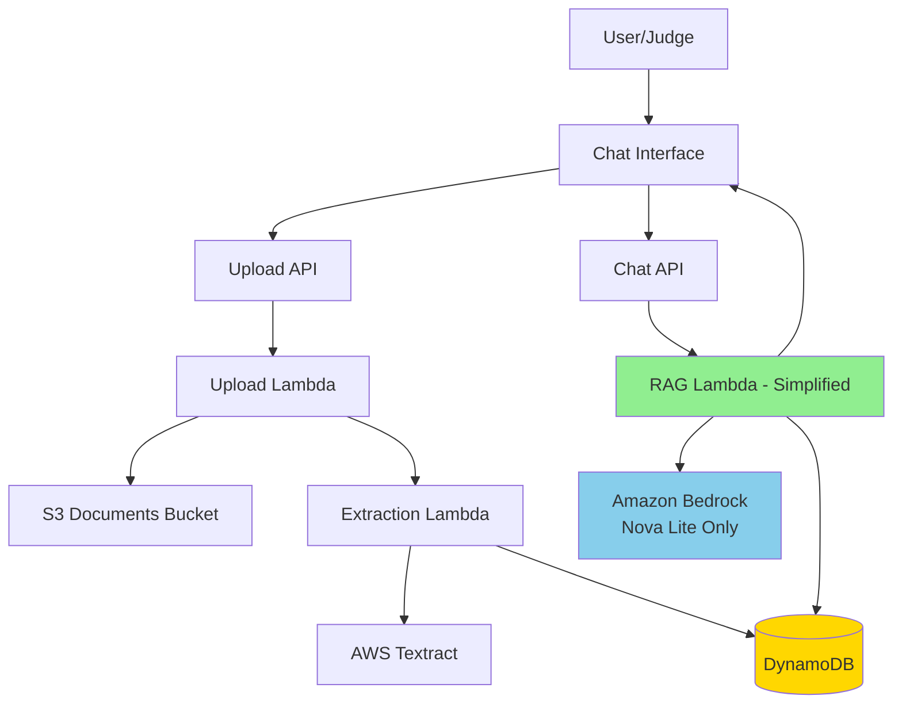

# Design Document: Simplified RAG Pipeline

## Overview

This design simplifies the MedAssist AI system by removing vector search complexity and translation features to ensure stable demo performance. The current system uses FAISS embeddings, Titan embeddings, Hindi translation, and a complex RAG pipeline that causes Lambda crashes and Bedrock throttling. The simplified architecture replaces vector search with direct document text retrieval and uses a single LLM model (Amazon Nova Lite) for reliable operation.

### Key Simplifications

1. **Remove FAISS Vector Search**: Eliminate FAISS library and numpy dependencies that cause Lambda crashes
2. **Remove Titan Embeddings**: Stop generating embeddings to avoid Bedrock throttling
3. **Remove Translation**: Remove Hindi translation features and AWS Comprehend integration
4. **Direct Text Retrieval**: Retrieve document text directly from DynamoDB using session ID
5. **Single LLM Model**: Use only Amazon Nova Lite (us.amazon.nova-lite-v1:0) for response generation

### Architecture Goals

- Stable Lambda execution without dependency crashes
- No Bedrock throttling from embedding generation
- Simple, predictable document retrieval
- Fast response times (under 10 seconds)
- Reliable demo flow from upload to answer

## Architecture

### System Components



### Data Flow

1. **Document Upload Flow**
   - User uploads PDF/image through frontend
   - Upload Lambda stores file in S3
   - Upload Lambda triggers Extraction Lambda asynchronously
   - Extraction Lambda calls Textract to extract text
   - Extraction Lambda stores extracted text in DynamoDB Document table
   - No embedding generation occurs

2. **Chat Query Flow**
   - User sends question through frontend with sessionId
   - RAG Lambda retrieves all document text for session from DynamoDB
   - RAG Lambda concatenates text (up to 4000 chars per document)
   - RAG Lambda constructs prompt with document context and question
   - RAG Lambda calls Nova Lite for answer generation
   - RAG Lambda returns answer to frontend
   - No embedding generation or vector search occurs

### Removed Components

The following components are removed from the system:

- FAISS index creation and storage in S3
- Embedding Lambda (no longer needed)
- Knowledge Base Embedding Lambda (no longer needed)
- Titan embedding model calls
- Hindi translation logic in RAG Lambda
- Language parameter handling in backend APIs
- Translation UI controls in frontend

## Components and Interfaces

### Upload Lambda (Modified)

**Purpose**: Handle document upload and initiate text extraction

**Modifications**:
- No changes to upload logic
- Extraction Lambda no longer triggers Embedding Lambda

**Interface**:
```typescript
// Request
POST /upload
{
  sessionId: string,
  role: "doctor" | "patient" | "asha",
  file: string (base64),
  filename: string,
  contentType: "application/pdf" | "image/jpeg" | "image/png"
}

// Response
{
  documentId: string,
  sessionId: string,
  status: "processing",
  message: string
}
```

### Extraction Lambda (Modified)

**Purpose**: Extract text from documents using Textract

**Modifications**:
- Remove Embedding Lambda invocation
- Store only extracted text (no embeddings)
- Remove medical entity extraction (Comprehend Medical) to simplify

**Interface**:
```typescript
// Input Event
{
  documentId: string,
  sessionId: string,
  s3Bucket: string,
  s3Key: string,
  contentType: string
}

// DynamoDB Storage
{
  PK: "DOC#{documentId}",
  SK: "METADATA",
  documentId: string,
  sessionId: string,
  extractedText: string,  // Full text from Textract
  status: "extracted" | "extraction_failed",
  extractedAt: string (ISO-8601)
}
```

### RAG Lambda (Simplified)

**Purpose**: Process chat queries using direct text retrieval and Nova Lite

**Major Changes**:
- Remove FAISS import and vector search logic
- Remove numpy import
- Remove Titan embedding generation
- Remove Hindi translation function
- Remove language parameter handling
- Implement direct DynamoDB text retrieval
- Use only Nova Lite model

**Interface**:
```typescript
// Request
POST /chat
{
  sessionId: string,
  role: "doctor" | "patient" | "asha",
  message: string
  // language parameter removed
}

// Response
{
  answer: string,
  source: "uploaded_document",
  timestamp: string (ISO-8601)
}

// Error Response
{
  error: {
    code: string,
    message: string,
    retryable: boolean,
    timestamp: string
  }
}
```

**Implementation Details**:

```python
def retrieve_document_text(session_id: str) -> str:
    """
    Retrieve all document text for a session directly from DynamoDB.
    No embedding generation or vector search.
    """
    # Query DynamoDB for all documents in session
    # Concatenate text up to 4000 chars per document
    # Return combined text as context
    
def generate_answer(context: str, question: str, role: str) -> str:
    """
    Generate answer using Nova Lite with document context.
    """
    prompt = construct_prompt(role, context, question)
    response = call_nova_lite(prompt)
    return response

def handler(event, context):
    """
    Simplified RAG handler:
    1. Parse request (no language parameter)
    2. Retrieve document text from DynamoDB
    3. Construct prompt with context
    4. Call Nova Lite
    5. Return answer
    """
```

### Chat Interface (Simplified)

**Purpose**: Provide simple English-only chat interface

**Modifications**:
- Remove language selector dropdown
- Remove translation toggle
- Remove language state management
- Remove language parameter from API calls

**Interface**:
```typescript
interface ChatInterfaceProps {
  sessionId: string;
  role: string;
  // language prop removed
}

// API Call (simplified)
sendChatMessage(sessionId, role, message)
// No language parameter
```

## Data Models

### Document Table (DynamoDB)

**Table Name**: MedAssist-Documents

**Schema**:
```typescript
{
  PK: string,              // "DOC#{documentId}"
  SK: string,              // "METADATA"
  documentId: string,
  sessionId: string,
  filename: string,
  contentType: string,
  s3Key: string,
  extractedText: string,   // Full extracted text
  uploadedAt: string,
  extractedAt: string,
  status: string,          // "uploaded" | "extracted" | "extraction_failed"
  errorMessage?: string
  // Removed: embeddings, medicalEntities, imageLabels
}
```

**Access Patterns**:
1. Get document by ID: `PK = "DOC#{documentId}" AND SK = "METADATA"`
2. Query documents by session: GSI on sessionId

### Session Table (DynamoDB)

**Table Name**: MedAssist-Sessions

**Schema** (unchanged):
```typescript
{
  PK: string,              // "SESSION#{sessionId}"
  SK: string,              // "METADATA"
  sessionId: string,
  role: string,
  createdAt: string,
  lastAccessedAt: string,
  documentIds: string[],
  status: string
}
```

### Chat History Table (DynamoDB)

**Table Name**: MedAssist-ChatHistory

**Schema** (unchanged):
```typescript
{
  PK: string,              // "SESSION#{sessionId}"
  SK: string,              // "MESSAGE#{timestamp}#{messageId}"
  sessionId: string,
  messageId: string,
  sender: "user" | "ai",
  content: string,
  timestamp: string,
  ttl: number
}
```

### Removed Data Structures

The following are removed:
- FAISS index files in S3 (`faiss-indices/`)
- Embedding vectors in Document table
- Knowledge base embeddings
- Medical entities from Comprehend Medical

## Prompt Template

The RAG Lambda uses a fixed prompt template for Nova Lite:

```
You are a medical document assistant. The following medical document text was uploaded by the user.

Document: {context}

User Question: {question}

Answer clearly using the document information. If the answer is not in the document, say you cannot find it in the report.
```

**Role-Specific Instructions** (optional enhancement):
- Doctor: "Provide clinical insights with technical accuracy"
- Patient: "Explain in simple terms without medical jargon"
- ASHA: "Focus on community health guidance"

## Error Handling

### Error Scenarios and Messages

1. **No Documents Uploaded**
   - Condition: Session has no documents in DynamoDB
   - Response: `{"error": {"code": "NO_DOCUMENTS", "message": "No documents found. Please upload a document first.", "retryable": false}}`

2. **Text Extraction Failed**
   - Condition: Textract fails to extract text
   - Response: `{"error": {"code": "EXTRACTION_FAILED", "message": "Failed to extract text from document. Please try again.", "retryable": true}}`

3. **Nova Lite API Failure**
   - Condition: Bedrock API call fails
   - Response: `{"error": {"code": "LLM_FAILED", "message": "Failed to generate answer. Please try again.", "retryable": true}}`

4. **Context Too Large**
   - Condition: Document text exceeds token limits
   - Action: Truncate context to fit within limits and proceed
   - Log warning to CloudWatch

5. **DynamoDB Query Failure**
   - Condition: Cannot retrieve documents from DynamoDB
   - Response: `{"error": {"code": "DATABASE_ERROR", "message": "Failed to retrieve documents. Please try again.", "retryable": true}}`

### Error Logging

All errors are logged to CloudWatch with structured JSON:

```json
{
  "event": "error_type",
  "sessionId": "string",
  "error": "error message",
  "timestamp": "ISO-8601"
}
```

## Testing Strategy

### Unit Testing

Unit tests verify specific examples, edge cases, and error conditions:

1. **Document Retrieval Tests**
   - Test retrieving documents for valid session
   - Test handling empty session (no documents)
   - Test concatenation with character limits

2. **Prompt Construction Tests**
   - Test prompt template formatting
   - Test role-specific instructions
   - Test context truncation

3. **Error Handling Tests**
   - Test no documents error
   - Test extraction failure error
   - Test Nova Lite failure error

4. **API Integration Tests**
   - Test upload endpoint without language parameter
   - Test chat endpoint without language parameter
   - Test CORS headers

### Property-Based Testing

Property tests verify universal properties across all inputs using a PBT library (e.g., Hypothesis for Python, fast-check for TypeScript). Each test runs minimum 100 iterations.


## Correctness Properties

*A property is a characteristic or behavior that should hold true across all valid executions of a system—essentially, a formal statement about what the system should do. Properties serve as the bridge between human-readable specifications and machine-verifiable correctness guarantees.*

### Property 1: Document Upload Triggers Text Extraction

*For any* document upload (PDF or image), the system should invoke Textract to extract text from the document.

**Validates: Requirements 3.1, 3.2**

### Property 2: Successful Extraction Stores Text with Session

*For any* successful text extraction, the extracted text should be stored in DynamoDB with the correct sessionId association.

**Validates: Requirements 3.3, 3.4**

### Property 3: Extraction Failure Returns Error

*For any* document where text extraction fails, the system should return a descriptive error message to the user.

**Validates: Requirements 3.5**

### Property 4: Document Retrieval Uses Session ID

*For any* chat question with a valid sessionId, the RAG Lambda should retrieve all documents associated with that session from DynamoDB.

**Validates: Requirements 4.1, 9.2, 9.3**

### Property 5: Document Text Truncation

*For any* document with text exceeding 4000 characters, the system should truncate the text to 4000 characters before concatenation.

**Validates: Requirements 4.2**

### Property 6: Prompt Construction with Template

*For any* user question, the system should construct a prompt following the specified template format that includes both document context and the user question.

**Validates: Requirements 5.1, 5.2**

### Property 7: Nova Lite Model Usage

*For any* LLM invocation, the system should call Amazon Bedrock with modelId "us.amazon.nova-lite-v1:0" and return a response in the format {"answer": string, "source": "uploaded_document"}.

**Validates: Requirements 5.3, 5.5**

### Property 8: Chat Request Contains Required Fields

*For any* chat request sent from the frontend, the JSON body should contain sessionId, role, and message fields.

**Validates: Requirements 6.1**

### Property 9: Messages Display in Chat History

*For any* message (user question or AI answer), the message should be displayed in the chat interface history.

**Validates: Requirements 6.2, 6.3**

### Property 10: End-to-End Flow Completion

*For any* complete user flow (upload document, extract text, ask question), all steps should complete successfully and return an answer.

**Validates: Requirements 7.5**

### Property 11: Context Truncation on Overflow

*For any* document context that exceeds token limits, the system should truncate the context and proceed with answer generation rather than failing.

**Validates: Requirements 10.4**

### Property 12: Error Logging

*For any* error that occurs in the system, a structured log entry should be written to CloudWatch with event type, error message, and timestamp.

**Validates: Requirements 10.5**

## Testing Strategy

### Dual Testing Approach

The testing strategy employs both unit tests and property-based tests to ensure comprehensive coverage:

- **Unit tests**: Verify specific examples, edge cases, and error conditions
- **Property tests**: Verify universal properties across all inputs through randomization

Both approaches are complementary and necessary. Unit tests catch concrete bugs in specific scenarios, while property tests verify general correctness across a wide range of inputs.

### Unit Testing

Unit tests focus on specific examples and edge cases:

1. **Document Upload Tests**
   - Test uploading a valid PDF document
   - Test uploading a valid image (JPEG/PNG)
   - Test rejecting invalid file types
   - Test handling missing sessionId

2. **Text Extraction Tests**
   - Test successful Textract extraction from sample PDF
   - Test successful Textract extraction from sample image
   - Test handling Textract service errors
   - Test storing extracted text in DynamoDB

3. **Document Retrieval Tests**
   - Test retrieving documents for a session with one document
   - Test retrieving documents for a session with multiple documents
   - Test handling session with no documents (edge case)
   - Test concatenation with 4000 character limit

4. **Prompt Construction Tests**
   - Test prompt template formatting with sample context and question
   - Test role-specific instructions (doctor, patient, asha)
   - Test handling empty context

5. **Nova Lite Integration Tests**
   - Test calling Nova Lite with valid prompt
   - Test handling Nova Lite API errors
   - Test response format validation

6. **Error Handling Tests**
   - Test "no documents" error message (edge case - Req 10.1)
   - Test extraction failure error message (edge case - Req 10.2)
   - Test Nova Lite failure error message (edge case - Req 10.3)
   - Test error logging to CloudWatch

7. **Frontend Tests**
   - Test chat interface sends correct request format
   - Test chat interface displays user messages
   - Test chat interface displays AI responses
   - Test absence of language selector UI elements

### Property-Based Testing

Property tests verify universal properties using **Hypothesis** (Python) for Lambda functions and **fast-check** (TypeScript) for frontend code. Each property test runs a minimum of 100 iterations with randomized inputs.

#### Python Property Tests (Lambda Functions)

1. **Property Test: Document Upload Triggers Extraction**
   - **Tag**: Feature: simplified-rag-pipeline, Property 1: Document Upload Triggers Text Extraction
   - **Generator**: Random document uploads (PDF/image) with random sessionIds
   - **Property**: For all uploads, Textract should be invoked
   - **Iterations**: 100

2. **Property Test: Extraction Storage**
   - **Tag**: Feature: simplified-rag-pipeline, Property 2: Successful Extraction Stores Text with Session
   - **Generator**: Random extracted text and sessionIds
   - **Property**: For all successful extractions, text should be in DynamoDB with correct sessionId
   - **Iterations**: 100

3. **Property Test: Document Retrieval by Session**
   - **Tag**: Feature: simplified-rag-pipeline, Property 4: Document Retrieval Uses Session ID
   - **Generator**: Random sessionIds with varying numbers of documents
   - **Property**: For all valid sessions, all associated documents should be retrieved
   - **Iterations**: 100

4. **Property Test: Text Truncation**
   - **Tag**: Feature: simplified-rag-pipeline, Property 5: Document Text Truncation
   - **Generator**: Random text strings of varying lengths (including > 4000 chars)
   - **Property**: For all documents, truncated text should be ≤ 4000 characters
   - **Iterations**: 100

5. **Property Test: Prompt Template Format**
   - **Tag**: Feature: simplified-rag-pipeline, Property 6: Prompt Construction with Template
   - **Generator**: Random contexts and questions
   - **Property**: For all inputs, prompt should contain template text, context, and question
   - **Iterations**: 100

6. **Property Test: Nova Lite Model ID**
   - **Tag**: Feature: simplified-rag-pipeline, Property 7: Nova Lite Model Usage
   - **Generator**: Random prompts
   - **Property**: For all LLM calls, modelId should be "us.amazon.nova-lite-v1:0"
   - **Iterations**: 100

7. **Property Test: Response Format**
   - **Tag**: Feature: simplified-rag-pipeline, Property 7: Nova Lite Model Usage
   - **Generator**: Random Nova Lite responses
   - **Property**: For all responses, format should be {"answer": string, "source": "uploaded_document"}
   - **Iterations**: 100

8. **Property Test: Error Logging**
   - **Tag**: Feature: simplified-rag-pipeline, Property 12: Error Logging
   - **Generator**: Random error conditions
   - **Property**: For all errors, CloudWatch should receive structured log entry
   - **Iterations**: 100

#### TypeScript Property Tests (Frontend)

1. **Property Test: Chat Request Format**
   - **Tag**: Feature: simplified-rag-pipeline, Property 8: Chat Request Contains Required Fields
   - **Generator**: Random sessionIds, roles, and messages
   - **Property**: For all chat requests, body should contain sessionId, role, and message
   - **Iterations**: 100

2. **Property Test: Message Display**
   - **Tag**: Feature: simplified-rag-pipeline, Property 9: Messages Display in Chat History
   - **Generator**: Random user and AI messages
   - **Property**: For all messages, they should appear in chat history after being sent/received
   - **Iterations**: 100

### Integration Testing

Integration tests verify the complete flow:

1. **End-to-End Flow Test**
   - Upload document → Extract text → Ask question → Receive answer
   - Verify each step completes successfully
   - Verify response time is reasonable (< 10 seconds for chat)

2. **Error Flow Tests**
   - Test complete flow with no documents uploaded
   - Test complete flow with extraction failure
   - Test complete flow with Nova Lite failure

### Test Configuration

**Property Test Library Setup**:
- Python: `pip install hypothesis pytest`
- TypeScript: `npm install --save-dev fast-check vitest`

**Minimum Iterations**: 100 per property test (configurable via test framework)

**Test Tagging**: Each property test includes a comment with the format:
```python
# Feature: simplified-rag-pipeline, Property 1: Document Upload Triggers Text Extraction
```

**CI/CD Integration**: All tests (unit and property) run on every commit to ensure continuous validation.

